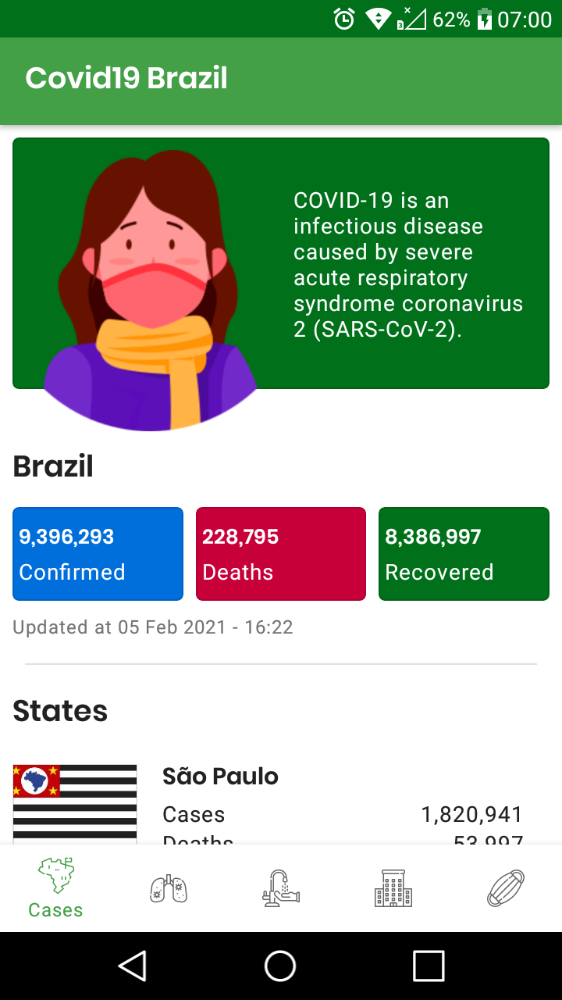
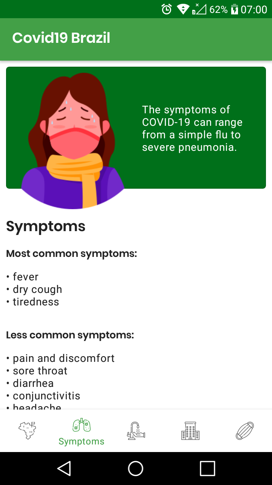
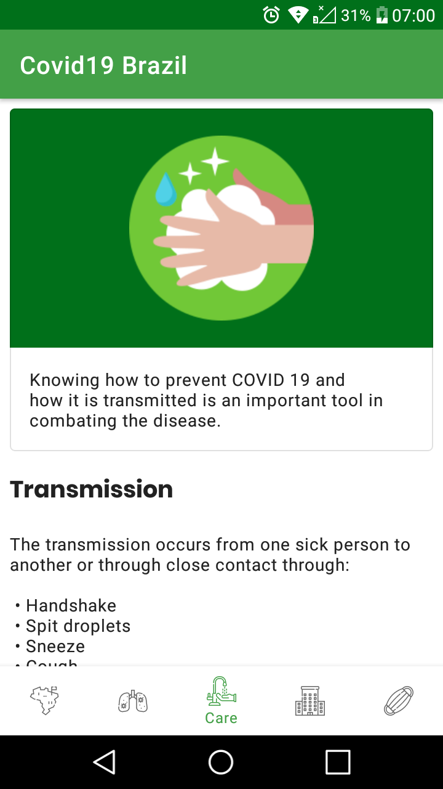

<h1 align="center">Covid 19 Brazil</h1>


<p align="center">


</p>

<p align="center">
 <a href="./README.md">Readme em Português </a> •
 <a href="#about">About</a> •
 <a href="#screenshots">Screenshots</a> •
 <a href="#download-app">Download app</a> •
 <a href="#building-the-project">Building the project</a> •
 <a href="#libraries-and-credits">Libraries and Credits</a> •
 <a href="#licensa">Licença</a>
</p>

## About

Covid 19 Brasil is an app with the objective of helping the population to face the COVID 19 pandemic, informing its symptoms, ways of prevention and useful information

## Screenshots

<p align="center">
  
</p>

## Download app

You can download it by clicking on this [link](https://github.com/Vitor238/Covid19-Brasil/releases/download/v1.3.0/covid19brasil.apk)

## Building the project

1. Clone the project by copying this command to your terminal:

   ```bash
   https://github.com/Vitor238/covid19brasil.git
   ```

2. Open the project on Android Studio   

## Libraries and Credits

#### Libraries and statistics API

* [Retrofit](https://github.com/square/retrofit)
* [Glide](https://github.com/bumptech/glide)
* [Proguard](https://developer.android.com/studio/build/shrink-code)
* [RoundedImageView](https://github.com/vinc3m1/RoundedImageView)
* [COVID-19 Brazil API](https://github.com/devarthurribeiro/covid19-brazil-api) - [Arthur Ribeiro](https://github.com/devarthurribeiro)

#### Images used in the APP

* [Coronavirus infographic of woman having symptoms](https://br.freepik.com/vetores-gratis/infografico-de-coronavirus-de-mulher-com-sintomas_7268263.htm#page=3&query=infografico+covid&position=39)
* Base logo icon - [Anthony Ledoux](https://www.iconfinder.com/Vntole)
* Bottom navigation icons - [Mangsaabguru](https://www.iconfinder.com/mangsaab) e [KonKapp](https://www.iconfinder.com/konkapp)
* [State flags](https://pt.wikipedia.org/wiki/Lista_de_bandeiras_do_Brasil)

#### Symptom, prevention and treatment information

* [Ministry of Health of Brazil](https://coronavirus.saude.gov.br/)
* [World Health Organization](https://www.who.int/emergencies/diseases/novel-coronavirus-2019)

## License

This project is licensed under [MIT license](https://opensource.org/licenses/MIT) - see the [LICENSE](LICENSE) file for more details.
