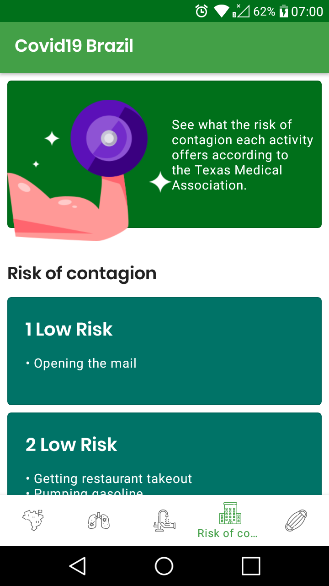

# Covid19 Brazil

A simple app that reports COVID-19 statistics in Brazil.

[Portuguese version](./README.md)

  

## Download
You can download it by clicking on this [link](https://github.com/Vitor238/covid19brasil/raw/master/covid19-brasil.apk)

## Libraries and sources used to create the project

* [Retrofit](https://github.com/square/retrofit)
* [Glide](https://github.com/bumptech/glide)
* [COVID-19 Brazil API](https://github.com/devarthurribeiro/covid19-brazil-api) - [Arthur Ribeiro](https://github.com/devarthurribeiro)
* [Infographic by freepik](https://br.freepik.com/fotos-vetores-gratis/infografico")
* Base logo icon - [Anthony Ledoux](https://www.iconfinder.com/Vntole)
* Bottom navigation icons - [Mangsaabguru](https://www.iconfinder.com/mangsaab) e [KonKapp](https://www.iconfinder.com/konkapp)
* [Ministry of Health of Brazil](https://coronavirus.saude.gov.br/)

## License

This project is licensed under [MIT license](https://opensource.org/licenses/MIT) - see the [LICENSE](LICENSE) file for more details.
