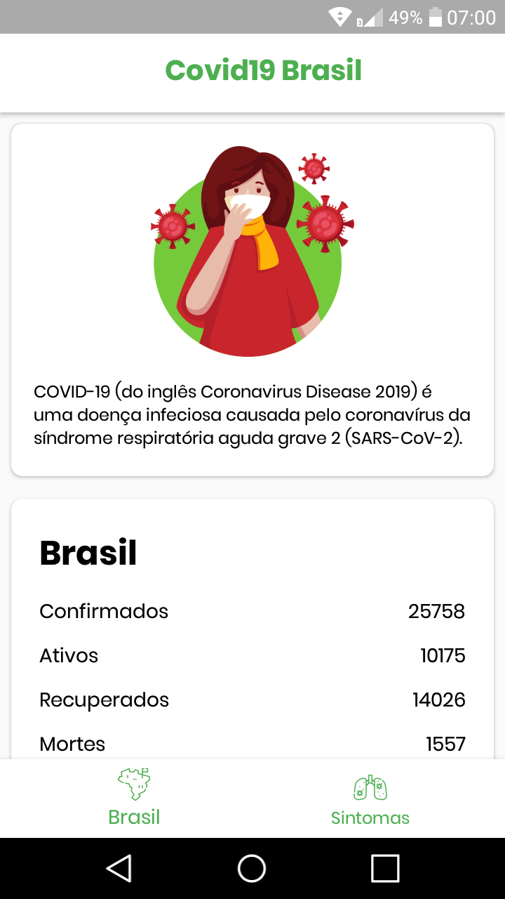
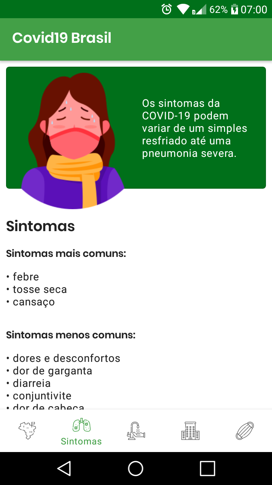
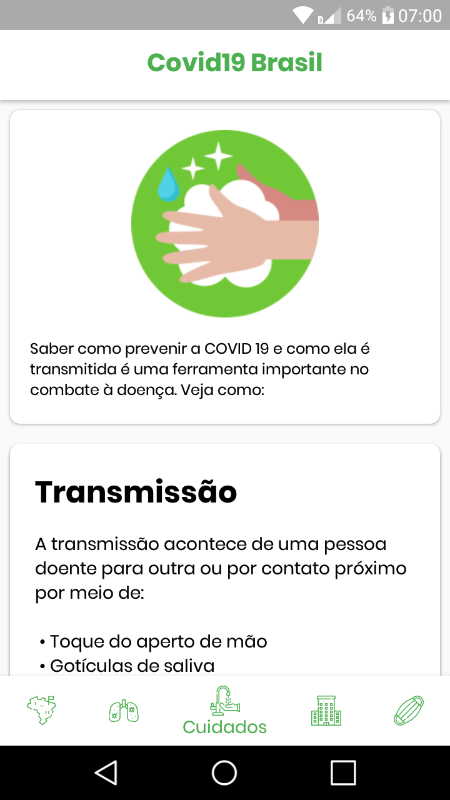

# Covid19 Brasil

Um aplicativo simples que informa estatísticas sobre a COVID-19 no Brasil.

:us: A simple app that reports COVID-19 statistics in Brazil. Available in English.

  

## Download do app
Você pode fazer o download clicando neste [link](https://github.com/Vitor238/covid19brasil/raw/master/covid19-brasil.apk)

## Bibliotecas e material utlizado para criar o projeto

* [Retrofit](https://github.com/square/retrofit)
* [Glide](https://github.com/bumptech/glide)
* [COVID-19 Brazil API](https://github.com/devarthurribeiro/covid19-brazil-api)
* [Infográfico por freepik](https://br.freepik.com/fotos-vetores-gratis/infografico")
* Icone base do logo - [Anthony Ledoux](https://www.iconfinder.com/Vntole)
* Icones do bottom navigation - [Mangsaabguru](https://www.iconfinder.com/mangsaab) e [KonKapp](https://www.iconfinder.com/konkapp)
* [Ministério da Saúde](https://coronavirus.saude.gov.br/)

## Licença

Este projeto está licenciado sob a [licença MIT](https://opensource.org/licenses/MIT) - consulte o arquivo [LICENSE](LICENSE) para mais detalhes.
