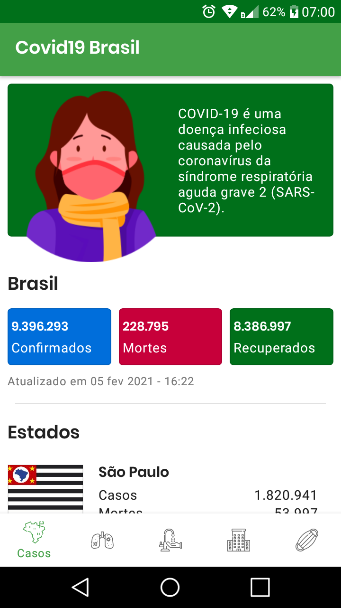
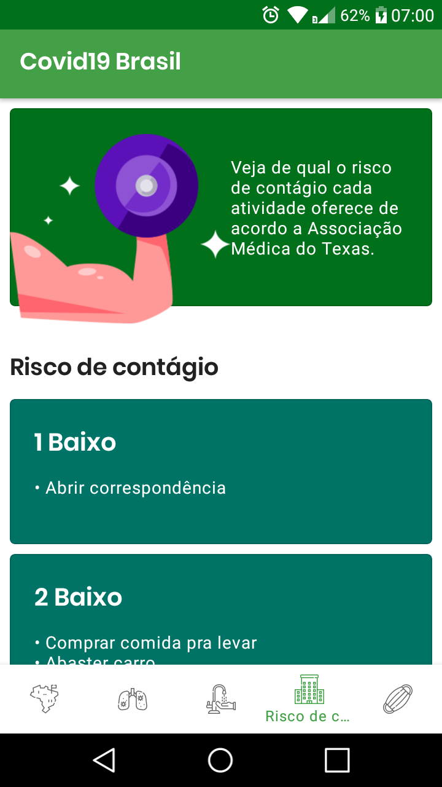

# Covid19 Brasil


<p align="center">


</p>

<p align="center">
 <a href="./README-EN.md">:us: Read me English</a> •
 <a href="#sobre">Sobre</a> •
  <a href="#capturas-de-tela">Capturas de tela</a> •
 <a href="#baixar-app">Baixar app</a> •
 <a href="#executar-o-projeto">Executar o projeto</a> •
 <a href="#bibliotecas-e-créditos">Bibliotecas e Créditos</a> •
 <a href="#licença">Licença</a>
</p>

## Sobre

Covid19 Brasil é um aplicativo com o objetivo de ajudar a população a enfrentar a pandemia de COVID 19, informando seus sintomas,formas de prevenção e informações úteis

## Capturas de tela

<p align="center">
   
</p>

## Baixar app

Você pode fazer o download clicando neste [link](https://github.com/Vitor238/covid19brasil/raw/master/covid19-brasil.apk)

## Executar o projeto

1. Clone o projeto copiando este comando em seu terminal :
   
   ```bash
   git clone https://github.com/Vitor238/covid19brasil.git
   ```

2. Abra o projeto no Android Studio   

## Bibliotecas e Créditos

#### Bibliotecas e API de estatísticas

* [Retrofit](https://github.com/square/retrofit)
* [Glide](https://github.com/bumptech/glide)
* [Proguard](https://developer.android.com/studio/build/shrink-code)
* [RoundedImageView](https://github.com/vinc3m1/RoundedImageView)
* [COVID-19 Brazil API](https://github.com/devarthurribeiro/covid19-brazil-api) - [Arthur Ribeiro](https://github.com/devarthurribeiro)

#### Imagens utilizadas no app

* [Infográfico de coronavírus de mulher com sintomas](https://br.freepik.com/vetores-gratis/infografico-de-coronavirus-de-mulher-com-sintomas_7268263.htm#page=3&query=infografico+covid&position=39)

* Icone base do logo - [Anthony Ledoux](https://www.iconfinder.com/Vntole)

* Icones do bottom navigation - [Mangsaabguru](https://www.iconfinder.com/mangsaab) e [KonKapp](https://www.iconfinder.com/konkapp)

#### Informações de sintomas,prevenção e tratamento

* [Ministério da Saúde](https://coronavirus.saude.gov.br/)
* [Organização Mundial da Saúde](https://www.who.int/emergencies/diseases/novel-coronavirus-2019)

## Licença

Este projeto está licenciado sob a [licença MIT](https://opensource.org/licenses/MIT) - consulte o arquivo [LICENSE](LICENSE) para mais detalhes.
